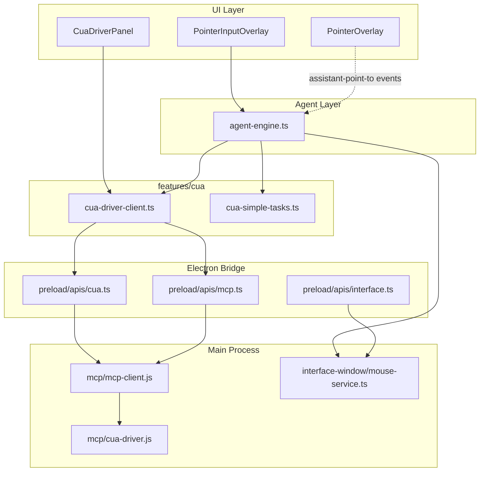

# Cua Driver & Agent OS Automation

Architecture reference for **Cua Driver** integration and the **Agent** computer-use loop in Buddy (SonicThinking).

Use this doc when adding features, debugging automation, or splitting the code into cleaner modules.

---

## Overview

Buddy can control the desktop in two ways:

| Path | When used | User-visible? |
|------|-----------|---------------|
| **Cua Driver** (preferred) | `cua-driver` installed and MCP server registered | Background: no cursor overlay, no focus steal, Agent pill hidden |
| **robotjs fallback** | Cua not installed or session init fails | Visible: pointer animation, mouse moves, needs `pointer-click` flag |

**Typical flow**

1. User types a task in the **Agent** pill (`PointerInputOverlay`).
2. `agent-engine.ts` tries a **simple fast path** (`open notepad and type hello world`).
3. If that fails, it starts a **vision loop**: screenshot → AI decides action → execute → repeat.
4. Cua actions use MCP tools with `dispatch: "background"`.
5. On completion, a toast reports success or failure.

**External dependency:** [Cua Driver](https://github.com/trycua/cua) — a local MCP server that talks to `cua-driver.exe` (or the macOS/Linux binary).

---

## Architecture



---

## File & folder map

### Core Cua module (frontend) — **primary maintenance boundary**

```
frontend/src/features/cua/
├── index.ts                      # Public barrel — import from @/features/cua only
├── cua-driver-client.ts          # MCP wrapper: windows, actions, headless mode, status
├── cua-simple-tasks.ts           # Deterministic fast path (open app + type)
└── components/
    └── CuaDriverPanel.tsx        # Settings: install status, smoke test button
```

| File | Responsibility |
|------|----------------|
| `cua-driver-client.ts` | `listCuaWindows`, `performCuaAction`, `captureCuaWindowScreenshot`, `prepareCuaBackgroundSession`, `setCuaAgentCursorEnabled`, window picking, coord math |
| `cua-simple-tasks.ts` | `parseSimpleCuaTask`, `launchAppByName`, `typeInWindow`, `executeSimpleCuaTask` |
| `CuaDriverPanel.tsx` | Settings UI only — no agent logic |

### Agent orchestration

```
frontend/src/app/overlays/
├── agent-engine.ts               # Main loop, Cua vs robotjs routing, AI prompts
├── PointerInputOverlay.tsx       # Agent pill — starts runAgent, silent UI when Cua ready
├── PointerOverlay.tsx            # Pointer animation (robotjs path; listens to custom events)
└── OverlayRegistry.tsx           # Registers overlays above
```

| File | Responsibility |
|------|----------------|
| `agent-engine.ts` | `runAgent`, `performAction`, `initCuaSession`, `captureScreenshot`, roadmap + vision loop |
| `PointerInputOverlay.tsx` | User input, abort (Esc), toasts, hides pill during Cua background runs |
| `PointerOverlay.tsx` | `assistant-agent-state`, `assistant-point-to`, `assistant-click` events |

### Main process — MCP & binary resolution

```
mcp/
├── cua-driver.js                 # Resolve cua-driver binary, auto-register MCP, smoke test
├── mcp-client.js                 # MCP IPC, Cua startup registration, cua:* handlers
├── mcp-store.js                  # Persists server list (electron-store)
└── mcp-connection.js             # MCP transport (shared)

application/application.js        # Instantiates McpClient on app start
```

### Electron bridge (preload + types)

```
interface-window/preload/
├── index.ts                      # Exposes mcpAPI + cuaAPI + interfaceAPI
└── apis/
    ├── cua.ts                    # cua:get-status, cua:ensure-server, cua:smoke-test
    ├── mcp.ts                    # listServers, connect, callTool
    └── interface.ts              # clickAt, typeString (robotjs fallback)

frontend/src/types/electron.d.ts  # window.cuaAPI, window.mcpAPI, CuaDriverStatus types
```

**After changing preload:** `npm run build:interface` then restart the app.

### Settings integration

```
frontend/src/features/settings/sections/McpServersSection.tsx   # Embeds CuaDriverPanel
frontend/src/features/settings/menu.ts                        # "mcp-servers" section id
```

### robotjs fallback (when Cua unavailable)

```
interface-window/
├── mouse-service.ts              # robotjs: clickAt, typeString, scroll, keyTap
├── interface-window.ts           # IPC: interface-window:click-at, type-string, etc.
└── preload/apis/interface.ts     # window.interfaceAPI
```

### Feature flags

```
frontend/src/features/feature-flags/definitions/
├── pointer-always-visible.feature.ts   # Must be on to show Agent pill
└── pointer-click.feature.ts            # Required for robotjs clicks only — not for Cua
```

### Dev & test

```
scripts/test-cua-driver.js          # Standalone CLI smoke test
package.json                        # npm run test-cua-driver
```

### Related (not Cua-specific)

```
frontend/src/components/assistant-animation/use-live-assistant.ts   # Dispatches assistant-point-to
remote-pad/input-handler.js                                         # Uses MouseService for remote pad
```

---

## Runtime paths (user machine, not in repo)

| Path | Purpose |
|------|---------|
| `%LOCALAPPDATA%\Programs\Cua\cua-driver\bin\cua-driver.exe` | Default Windows install |
| `~/.local/bin/cua-driver` | Typical Linux install |
| `%APPDATA%\SonicThinking\mcp-servers.json` | Buddy MCP server config (includes "Cua Driver") |
| Scheduled task `cua-driver-serve` | Cua daemon (if installed via Cua installer) |

**Binary resolution order** (`mcp/cua-driver.js`):

1. Bundled in app resources (`extraResources` — packaging TBD)
2. Default install path (see above)
3. `PATH`

---

## Public API (`@/features/cua`)

Import only from the barrel:

```typescript
import {
  isCuaDriverReady,
  prepareCuaBackgroundSession,
  performCuaAction,
  executeSimpleCuaTask,
  parseSimpleCuaTask,
  listCuaWindows,
  // ...
} from '@/features/cua'
```

### Key functions

| Function | Purpose |
|----------|---------|
| `isCuaDriverReady()` | Binary installed + MCP server registered |
| `prepareCuaBackgroundSession()` | Disables Cua agent cursor overlay (once per session) |
| `setCuaAgentCursorEnabled(bool)` | Direct MCP call to `set_agent_cursor_enabled` |
| `performCuaAction(window, action)` | click / type / key / scroll with `dispatch: 'background'` |
| `executeSimpleCuaTask(task, signal)` | Fast path without AI vision loop |
| `parseSimpleCuaTask(task)` | Returns `{ app, text }` or `null` |
| `launchAppByName(appKey)` | MCP `launch_app` + pick window |
| `getCuaDriverStatus()` | Installed, command path, serverId |
| `runCuaSmokeTest()` | End-to-end health check |

### IPC (`window.cuaAPI`)

| Channel | Handler | Returns |
|---------|---------|---------|
| `cua:get-status` | `mcp-client.js` | `CuaDriverStatus` |
| `cua:ensure-server` | Registers MCP server if binary found | `{ ok, serverId? }` |
| `cua:smoke-test` | Lists tools, windows, optional capture | `CuaSmokeTestResult` |

MCP tool calls go through `window.mcpAPI.callTool(serverId, toolName, args)`.

---

## Agent execution paths

### 1. Simple fast path

Triggered when `parseSimpleCuaTask(task)` matches, e.g.:

- `open notepad and type hello world`
- `launch calculator and type 2+2`
- `type hello in notepad`

Steps: `prepareCuaBackgroundSession` → `launch_app` → click editor center → `type_text` (all background).

### 2. Vision loop

Used for complex or unmatched tasks:

1. `initCuaSession(task)` — pick or launch target window
2. `buildRoadmap(task)` — AI step plan
3. Loop (max steps): `captureScreenshot` or Cua window capture → `decideNextMove` → `performAction`
4. Cua branch in `performAction` uses window-relative coords via `cuaCoordsFromPercent`

### 3. robotjs fallback

When `initCuaSession` returns false:

- Full-screen capture via `CaptureAPI.quickScreenshot`
- Clicks via `window.interfaceAPI.clickAt` (moves real mouse)
- Requires feature flag `pointer-click`
- Dispatches `assistant-point-to` / `assistant-click` for `PointerOverlay`

---

## Background / headless behavior

When Cua Driver is ready:

| Behavior | Implementation |
|----------|----------------|
| No Cua arrow overlay | `prepareCuaBackgroundSession()` → `set_agent_cursor_enabled: false` |
| No focus steal | All Cua tools use `dispatch: 'background'` |
| No Buddy pointer animation | `PointerInputOverlay` skips `setAgentRunning(true)` |
| Agent pill hidden while running | `PointerInputOverlay` returns `null` during silent run |
| Completion feedback | Sonner toast only |
| Cancel | **Esc** still aborts via `AbortController` |

**Note:** Target apps (e.g. Notepad) may still appear on screen. Cua launches with `SW_SHOWNOACTIVATE` on Windows — no focus steal, but the window is not fully invisible.

---

## Cua MCP tools used by Buddy

| Tool | Used for |
|------|----------|
| `launch_app` | Open notepad, calculator, edge, etc. |
| `list_windows` | Find automation target |
| `get_window_state` | Vision-mode screenshot for AI loop |
| `click` / `double_click` / `right_click` | Pointer actions |
| `type_text` | Text insertion |
| `press_key` | Keyboard shortcuts |
| `scroll` | Scroll in window |
| `set_agent_cursor_enabled` | Hide visual agent cursor |

Full tool list: run `npm run test-cua-driver` or `cua-driver list`.

---

## Development commands

```bash
# Verify Cua MCP + binary (from buddy/)
npm run test-cua-driver

# Rebuild preload after changing interface-window/preload/
npm run build:interface

# Run full app
npm run dev
```

**Manual smoke test (PowerShell):**

```powershell
'{"name":"notepad"}' | & "$env:LOCALAPPDATA\Programs\Cua\cua-driver\bin\cua-driver.exe" call launch_app
```

Pipe JSON via stdin — do not pass JSON as a CLI argument (PowerShell strips quotes).

---

## Where to change what

| Goal | Edit |
|------|------|
| Add new simple task pattern | `cua-simple-tasks.ts` → `parseSimpleCuaTask` + `APP_NAME_MAP` |
| Add new Cua MCP tool wrapper | `cua-driver-client.ts` + export from `index.ts` |
| Change AI agent behavior / prompts | `agent-engine.ts` |
| Change Agent UI (pill, toasts) | `PointerInputOverlay.tsx` |
| Change pointer animation | `PointerOverlay.tsx` |
| Binary path / bundling | `mcp/cua-driver.js` + electron-builder `extraResources` |
| New IPC for Cua | `mcp-client.js` + `preload/apis/cua.ts` + `electron.d.ts` |
| Settings status UI | `CuaDriverPanel.tsx` |
| robotjs fallback behavior | `mouse-service.ts` + `agent-engine.ts` performAction fallback branch |
| Feature flag defaults | `frontend/src/lib/settings/default-feature-flags.ts` |

---

## Suggested future modularization

Today the code is split reasonably, but these moves would make maintenance easier:

### 1. Extract `features/agent/` (new module)

Move from `app/overlays/`:

- `agent-engine.ts` → `features/agent/agent-engine.ts`
- Agent types, prompts, and step types into `features/agent/types.ts`

Keep thin UI shells in `app/overlays/`:

- `PointerInputOverlay.tsx` — only UI + calls `runAgent`
- `PointerOverlay.tsx` — only animation

### 2. Keep all Cua MCP in `features/cua/`

Do not call `window.mcpAPI` from `agent-engine.ts` directly — always go through `@/features/cua`.

### 3. Optional `packages/cua-bridge/` (monorepo)

If Buddy grows, move main-process code:

- `mcp/cua-driver.js`
- Cua-specific parts of `mcp-client.js`

Renderer stays on `@/features/cua`.

### 4. Packaging checklist (end users)

- [ ] Bundle `cua-driver` in `extraResources` (paths already in `resolveBundledCuaDriverPath`)
- [ ] Auto-register MCP on first launch (`ensureCuaDriverServer`)
- [ ] Document one-time Cua install vs bundled binary in release notes

---

## Troubleshooting

| Symptom | Check |
|---------|-------|
| Agent does nothing | Feature flag `pointer-always-visible`; Cua status in Settings → MCP |
| Opens app but no typing | Run `npm run test-cua-driver`; try simple phrase `open notepad and type hello` |
| `list_windows` returns 0 | MCP connection; ensure Cua daemon / scheduled task running |
| Visible mouse / pointer | Cua not ready — falling back to robotjs; install Cua Driver |
| Cua arrow still shows | `prepareCuaBackgroundSession` not called; restart app after update |
| JSON errors in CLI | Pipe JSON via stdin, not as argument |

---

## See also

- `AGENTS.md` — project-wide agent/developer guide
- `frontend/ARCHITECTURE.md` — frontend module conventions
- [Electron IPC docs](https://www.electronjs.org/docs/latest/api/ipc-main)
- [Cua Driver](https://github.com/trycua/cua) — upstream project
