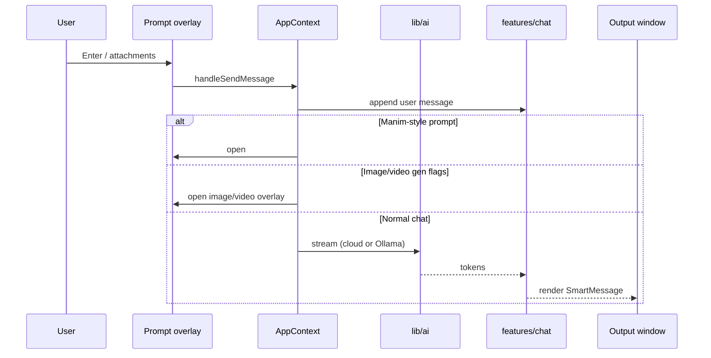
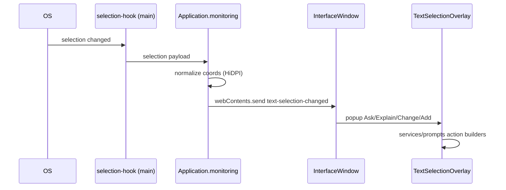
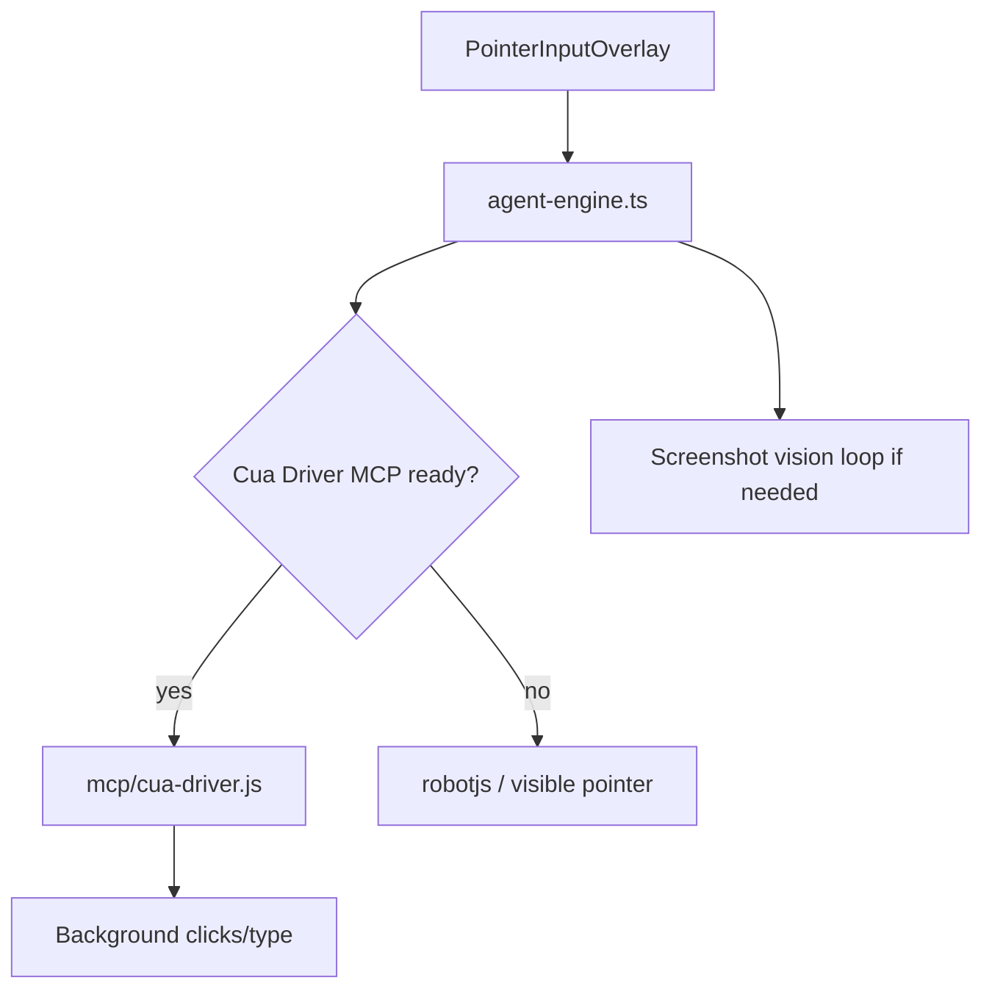
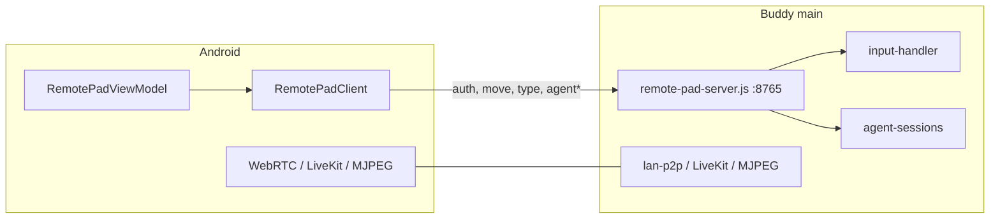
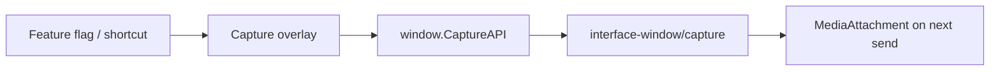
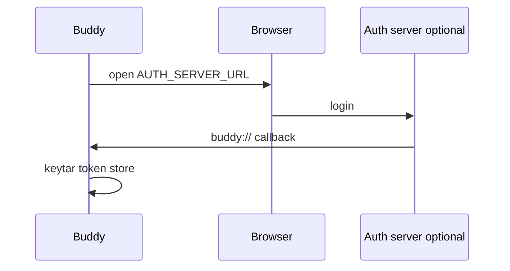

# Data flows

Runtime paths for the main product loops. Folder map: [architecture.md](architecture.md).

## Chat (send → stream → window)

Change streaming: `hooks/useMessageManager` (also used from AppContext) and `frontend/src/lib/ai`.  
Change bubbles: `features/chat` and `features/output-window`.

## Text selection (OS → popup → AI)

Native rebuild: `npm run build:interface`. Flag: `text-selection`.

## Agent pill (computer use)

Deep dive: [cua-architecture.md](cua-architecture.md).

## Remote Pad (phone → PC)

Input always uses the WebSocket. Video is optional and can fail over.  
[remote-pad.md](remote-pad.md).

## Capture

Flags: `quick-screenshot`, `area-screenshot`, `video-recording`, `auto-screenshot`.

## Auth (optional)

Local keys in Settings work with **no** auth server. [auth/README.md](../auth/README.md).
